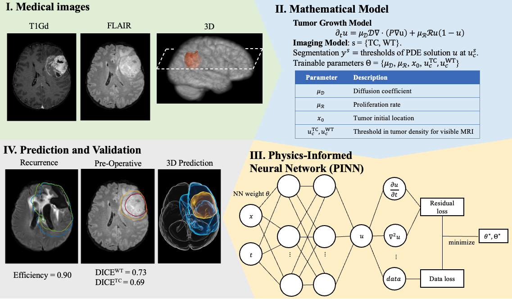

# Personalized Predictions of Glioblastoma Infiltration: Mathematical Models, Physics-Informed Neural Networks and Multimodal Scans


This repository contains the code the paper [Personalized Predictions of Glioblastoma Infiltration: Mathematical Models, Physics-Informed Neural Networks and Multimodal Scans](https://arxiv.org/abs/2312.05063)





## Citation
If you find this code useful in your research, please consider citing:

```
@misc{zhangPersonalizedPredictionsGlioblastoma2024,
  title = {Personalized Predictions of Glioblastoma Infiltration: Mathematical Models, Physics-Informed Neural Networks and Multimodal Scans},
  shorttitle = {Personalized Predictions of Glioblastoma Infiltration},
  author = {Zhang, Ray Zirui and Ezhov, Ivan and Balcerak, Michal and Zhu, Andy and Wiestler, Benedikt and Menze, Bjoern and Lowengrub, John},
  year = {2024},
  doi = {10.48550/arXiv.2311.16536},
}
```


## Dataset and Simulations

[Dataset and example scripts](https://drive.google.com/drive/folders/1vizr-eytL2EBhO2KuQrpzsn3McnvwLWT?usp=sharing)

Patient data P1-P8 in the paper is obtained from

*Lipkova et al., Personalized Radiotherapy Design for Glioblastoma Using Mathematical Tumor Modelling, Multimodal Scans and Bayesian Inference. IEEE Transactions on Medical Imaging (2019)* [[Paper]](https://ieeexplore.ieee.org/document/8654016) [[GitHub&Data]](https://github.com/JanaLipkova/GliomaSolver).
